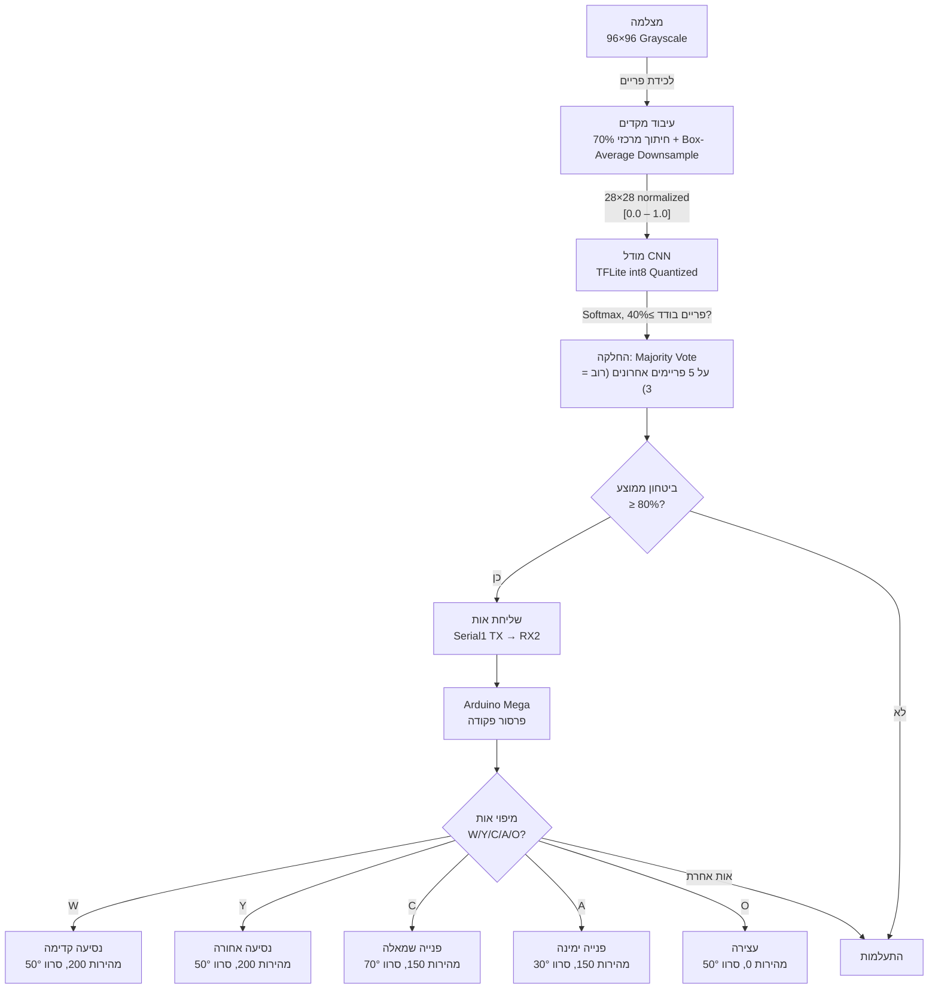
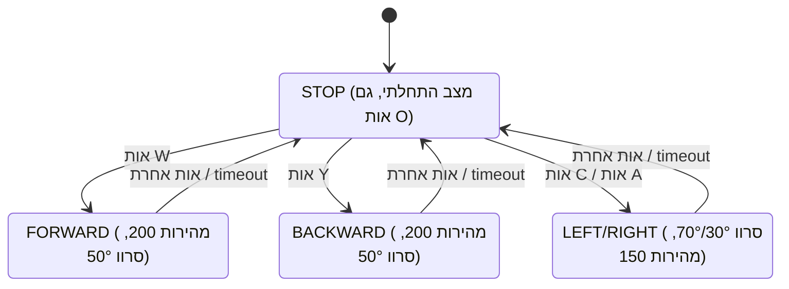
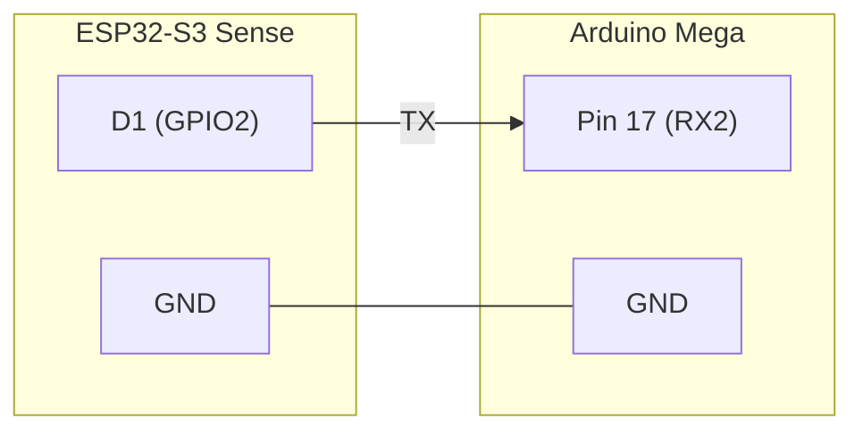

# דוח טכני (ASL): שליטה ברכב רובוטי באמצעות זיהוי שפת סימנים

**שם הפרויקט:** שליטה ברכב רובוטי בזמן אמת באמצעות זיהוי תנועות שפת הסימנים האמריקאית (ASL)

**שמות הסטודנטים:** סהר באביאן, ליאל אוונונו

**תאריך הגשה:** 14.7.26

## 1. תקציר

הפרויקט משלב למידה עמוקה עם רובוטיקה פיזית: רכב אוטונומי הנשלט בתנועות יד בשפת הסימנים האמריקאית (ASL). המערכת בנויה משני בקרים — מחשב נייד עם מצלמה המריץ רשת CNN בטכנולוגיית TinyML לזיהוי האותיות, ובקר **Arduino Mega** המפעיל רכב עם שני מנועי DC וסרוו היגוי. הרשת אומנה מאפס על מאגר Sign Language MNIST (27,455 תמונות אימון), עברה Fine-tuning עם דגימות שנלכדו ממצלמת הפרויקט, ולאחר מכן קוונטיזציה מלאה ל-int8 לצורך הטמעה על המיקרו-בקר. המערכת מזהה 24 אותיות ומתרגמת חמש מהן (W, Y, C, A, O) לפקודות נסיעה — קדימה, אחורה, שמאלה, ימינה ועצירה — לאחר החלקת הצבעה (Majority Vote) על מספר פריימים וסף ביטחון של 80%, עם עצירת בטיחות אוטומטית לאחר 1.5 שניות ללא פקודה.

## 2. מבוא

### 2.1 הגדרת הבעיה

המשימה: לאפשר שליטה ברכב רובוטי פיזי באמצעות תנועות יד בלבד. המשתמש מציג אות ASL למצלמת המחשב, והמערכת מזהה אותה ומתרגמת לפקודת נסיעה בזמן אמת. האתגר המרכזי הוא ביצוע סיווג תמונה על חומרה פנימית בלבד, תוך שמירה על דיוק מספק לשליטה אמינה.

### 2.2 מוטיבציה וגישה

רשת נוירונים נבחרה מכיוון שגישות קלאסיות של עיבוד תמונה (התאמת תבניות, סף צבע) אינן עמידות לשינויי תאורה, רקע וזווית. סוג השימוש: אימון מאפס (Training from Scratch) ולאחריו Fine-tuning עם דגימות מותאמות. הסיבות:

1. קלט 28×28 בגווני אפור מאפשר מודל קטן מטבעו.
2. ביצוע **Fine-tuning** סוגר פער דומיין **(Domain Shift)** — איסוף דגימות מהמצלמה הספציפית של הפרויקט ואימון מחדש מתאימים את המודל לתנאי השטח, לעומת תמונות הסטודיו הנקיות של מאגר הנתונים המקורי.

## 3. חומרה, סביבה ורקע טכנולוגי

### 3.1 הפלטפורמה הרובוטית

| **רכיב** | **תיאור** |
|---|---|
| מיקרו-בקר זיהוי | ESP32-S3 Sense — Xtensa LX7 Dual-Core 240MHz, 8MB PSRAM, ~255KB DRAM פנימי |
| מחשב נייד | מחשב הכולל מצלמה |
| מצלמה | מובנית במיקרו-בקר הזיהוי, לכידה ב-96×96 גווני אפור |
| מיקרו-בקר רכב | Arduino Mega 2560 — ATmega2560, 16MHz |
| מנועים | 2 מנועי DC (עם אינקודרים בפינים 2/3, 18/19), דרייבר L298N |
| היגוי | סרוו על פין 9 (30°=ימין, 50°=ישר, 70°=שמאל) |
| תקשורת בין הבקרים | כבל: Serial1 (GPIO2) → RX2 (פין 17), 9,600 baud<br>Bluetooth: מודל HC-05/HC-06 → Serial3 (פינים 14/15), 9,600 baud |

המצלמה היא חיישן הקלט היחיד. הפריים (96×96, גווני אפור) עובר חיתוך מרכזי (70% מהפריים) ולאחר מכן דגימה מחדש בממוצע-תיבה (Box-Average Downsample, לא Nearest-Neighbor) ל-28×28 פיקסלים — גודל קלט המודל. אין זיהוי יד אמיתי על המיקרו-בקר (יקר מדי חישובית); המשתמש נדרש למרכז את היד בפריים.

### 3.2 סביבת האימון

אימון מתבצע בקונטיינר Docker מבוסס `tensorflow/tensorflow:2.15.0`, עם OpenCV (לכידה ועיבוד תמונה), NumPy, Pandas (טעינת CSV) ו-`xxd` (המרה ל-C++ Header). הסביבה רצה על Ubuntu עם גישה ל-`/dev/video0` ול-X11 להצגת חלונות OpenCV בזמן אימון ובדיקה.

### 3.3 המודל שנבחר — CNN מותאם

בניגוד לשימוש במודל פרה-מאומן גדול (YOLO, MobileNet, ResNet), כאן אומנה רשת **CNN** קטנה מאפס, מכיוון ש:

1. הקלט (28×28 גווני אפור, 784 ערכים) פשוט ואינו דורש ארכיטקטורה עמוקה.
2. מספר קטן של 24 מחלקות בלבד מאפשר לרשת קלה להשיג דיוק גבוה.

| `Layer (type)`<br> | `Output Shape          Params`<br> |
|---|---|
| `Input` | `(28, 28, 1)           0` |
| `Conv2D (75 filters, 3×3)` | `(28, 28, 75)          750` |
| `BatchNormalization` | `(28, 28, 75)          300` |
| `MaxPool2D (2×2)` | `(14, 14, 75)          0` |
| `Conv2D (100 filters, 3×3)` | `(14, 14, 100)         67,600` |
| `Dropout (0.2)` | `(14, 14, 100)         0` |
| `BatchNormalization` | `(14, 14, 100)         400` |
| `MaxPool2D (2×2)` | `(7, 7, 100)           0` |
| `Conv2D (128 filters, 3×3)` | `(7, 7, 128)           115,328` |
| `Dropout (0.3)` | `(7, 7, 128)           0` |
| `BatchNormalization` | `(7, 7, 128)           512` |
| `MaxPool2D (2×2)` | `(4, 4, 128)           0` |
| `Conv2D (64 filters, 3×3)` | `(4, 4, 64)            73,792` |
| `BatchNormalization` | `(4, 4, 64)            256` |
| `MaxPool2D (2×2)` | `(2, 2, 64)            0` |
| `Flatten` | `(256)                 0` |
| `Dense (512 units, ReLU)` | `(512)                 131,584` |
| `Dropout (0.4)` | `(512)                 0` |
| `Dense (24 units, Softmax)`<br>`──────────────────────────` | `(24)                  12,312`<br>`───────────────────────────────` |
| `Total params: ~402,834` | |

4 שכבות קונבולוציה עם Batch Normalization ו-Max Pooling, ואחריהן Flatten ושתי שכבות Dense. Dropout (0.2–0.4) מונע Overfitting. הפעלה פנימית ReLU, פלט Softmax על 24 מחלקות.

## 4. ארכיטקטורת המערכת והמתודולוגיה

### 4.1 שילוב מודל ה-AI

#### _מאגר הנתונים_

| **מאגר** | **גודל** | **תיאור** |
|---|---|---|
| Sign Language MNIST (אימון) | 27,455 תמונות | 28×28, גווני אפור, 24 מחלקות (A–Y ללא J,Z) |
| Sign Language MNIST (ולידציה) | 7,172 תמונות | סט בדיקה נפרד |
| דגימות מותאמות (`custom_train.csv`) | כ-15–20 לאות יעד | נלכדו ממצלמת הפרויקט (`capture_data.py`) |
| הרחבת רקעים (`bg_augmented_train.csv`) | מרובה | הרכבת דגימות יד על רקעים מגוונים |

#### _תהליך האימון_

1. אימון מאפס — 20 אפוקים, Batch Size 32, אופטימייזר Adam.
2. הרחבת נתונים **(Data Augmentation)** דרך `ImageDataGenerator`: סיבוב ±35°, זום 40–160%, הזזה ±20%, גזירה ±25%, בהירות ±30%, היפוך אופקי.
3. אימון מחדש **(Fine-tuning)** — לאחר איסוף דגימות מותאמות, המודל הקיים נטען ואומן מחדש בקצב למידה נמוך (0.0001).
4. קצב הלמידה **(ReduceLROnPlateau)** — כשדיוק הולידציה לא משתפר במשך 2 אפוקים, מפחית קצב למידה ב-50% (עד מינימום 0.00001).

פונקציית הפסד: Categorical Cross-Entropy — מתאימה לסיווג רב-מחלקתי עם Softmax ותוויות One-Hot.

#### _קוונטיזציה והטמעה_

המרה ל-TensorFlow Lite עם קוונטיזציה מלאה ל-**int8** (משקלות והפעלות כאחד), כיול על 500 תמונות מייצגות מסט האימון; קלט/פלט נשארים ב-float32 לשמירת תאימות עם קוד ה-Inference. גודל סופי: כ-410**KB** (`.tflite`), מומר ל-C++ Header (`model.h`) באמצעות `xxd -i`.

### 4.2 זרימת הנתונים (Pipeline)



1. לכידת תמונה — 96×96 גווני אפור, הגודל הקטן ביותר שהחומרה תומכת בו.
2. עיבוד מקדים — חיתוך מרכזי (70% מהפריים) + דגימה-מחדש בממוצע-תיבה ל-28×28, נורמליזציה ל-[0.0, 1.0]. אין חיתוך יד אמיתי (יקר חישובית) — המשתמש ממרכז את היד ידנית.
3. הרצת המודל **(Inference)** — נטען לזירת חישוב (Tensor Arena) של 512KB ב-PSRAM, מורץ דרך TFLite Micro Interpreter. פלט: וקטור של 24 הסתברויות.
4. סינון והחלקה — תחזית פריים בודד נספרת רק אם ביטחונה ≥40%; אות נחשבת יציבה רק אם היא הרוב בחלון הפריימים האחרונים (3 מתוך 5, Majority Vote). היא נשלחת לרכב רק אם ממוצע הביטחון שלה ≥80%, מה שמצמצם רעש.
5. האות נשלחת כתו בודד דרך תקשורת Serial1 (GPIO2), 9,600 baud, אל RX2 (פין 17) של ה-Arduino Mega.
6. ה-Mega ממפה את האות לפקודת תנועה ומפעיל מנועים וסרוו — הפעלת מנועים עם סנכרון מבוסס אינקודרים (P-Controller) לנסיעה ישרה.

### 4.3 מערכת קבלת ההחלטות

לוגיקת הרכב מבוססת מכונת מצבים (State Machine) פשוטה:



STOP הוא מצב-מוקד: כל שלושת מצבי הפעולה (FORWARD, BACKWARD, LEFT/RIGHT) חוזרים אליו ברגע שמתקבלת אות אחרת או timeout.

##### מנגנוני בטיחות:

1. סף ביטחון (80%) — מסנן תחזיות לא ודאיות לפני שליחה לרכב.
2. **Timeout** של 1.5 שניות — הרכב עוצר אוטומטית אם לא מתקבלת פקודה חדשה.
3. זווית הסרוו משתנה הדרגתית (2° לאיטרציה ב-50Hz) — מעבר חלק בהיגוי, למניעת תנועות פתאומיות.

### 4.4 אפשרויות תקשורת

אפשרות 1 — חיבור ישיר בכבל (לרכב נייד):



אפשרות 2 — **USB** דרך מחשב: סקריפט `serial_bridge.py` קורא את יציאת ה-USB של ה-ESP32 (115,200 baud), מסנן לפי סף ביטחון, ומעביר את האות ליציאת ה-USB של ה-Arduino Mega (9,600 baud).

```
python src/serial_bridge.py --esp32 COM3 --car COM5 --threshold 80
```

אפשרות 3 — Bluetooth (ללא כבל למחשב): מודל **HC-05/HC-06** מחובר ל-`Serial3` של ה-Mega (TX3 פין 14, RX3 פין 15). לאחר צימוד (PIN בד"כ 1234 או 0000) וקישור ה-MAC Address ליציאה קבועה:

```
sudo rfcomm bind rfcomm0 <MAC_ADDRESS> 1
```

`run_model.py --car` (ללא ציון פורט) מזהה אוטומטית חיבור: מעדיף פורט חוט מחובר (`/dev/ttyACM*`, `/dev/ttyUSB*`), ואם אינו קיים נופל חזרה ל-`/dev/rfcomm*`. אותה תקשורת (W/Y/C/A/O, סף ביטחון), ללא שינוי קוד בין המצבים. כמו בחיבור ה-ESP32 הישיר, קו ה-`RXD` של מודל ה-Bluetooth רגיש ללוגיקת 5V של `RX3`, ולכן מומלץ מחלק מתח על קו זה:

```
python src/run_model.py webcam --keras --car
```

## 5. ניסויים ותוצאות

### 5.1 סביבת הניסוי

1. בדיקת מודל על המחשב — `test_model.py` עם מצלמת רשת בסביבת Docker.
2. סימולטור מבוסס-דפדפן — בדיקת שרשרת מלאה (`simulator/index.html`): קלט מקלדת (W/Y/C/A/O), הזנת לוגים אמיתיים מה-ESP32 כתחליף לתנועות יד (Log Replay), הדמיה ויזואלית של הרכב, סינון ביטחון חי, וספירה לאחור של ה-Timeout עם תזמון מקורי.

### 5.2 תוצאות כמותיות

דוגמה ללוג אמיתי מה-ESP32:

```
[105167 ms] letter=G  confidence=98.8%    ← לא פקודת רכב, מתעלם
[106398 ms] letter=C  confidence=59.4%    ← מתחת ל-80%, מתעלם
[107629 ms] letter=G  confidence=37.9%    ← מתחת ל-80%, מתעלם
[108860 ms] letter=C  confidence=60.5%    ← מתחת ל-80%, מתעלם
[113784 ms] letter=X  confidence=80.1%    ← עובר סף אבל לא פקודת רכב
[117477 ms] letter=X  confidence=93.8%    ← עובר סף אבל לא פקודת רכב
```

| **מדד** | **ערך** |
|---|---|
| סה"כ תחזיות בלוג לדוגמה | 19 |
| תחזיות מעל 80% | 3 (15.8%) |
| תחזיות מתחת ל-80% | 16 (84.2%) |
| ביטחון ממוצע (כלל) | 59.3% |
| ביטחון ממוצע (מעל סף) | 90.9% |

סף 80% מסנן ביעילות את רוב הרעש, ומעביר רק תחזיות בהן המודל בטוח ברמה גבוהה.

### 5.3 ביצועים בזמן אמת (Real-Time Performance)

| **מדד** | **ערך** |
|---|---|
| מרווח בין תחזיות | ~1,200 ms |
| קצב Inference | ~0.8 FPS |
| צוואר בקבוק | הרצת מודל TFLite על ESP32-S3 (לכידת פריים + Invoke) |
| זמן תגובת רכב מפקודה לתנועה | < 50 ms (לולאת Arduino ב-50Hz) |
| Baud Rate — ESP32→רכב | 9,600 bps |
| Baud Rate — ESP32 USB (לוג) | 115,200 bps |

ניתוח: קצב ~0.8 FPS מוגבל בכוח החישוב של ה-ESP32-S3. זמן תגובה של ~1.2 שניות סביר לשליטה ברכב — המשתמש מחזיק תנועת יד 1–2 שניות, ותוך זמן זה מתקבלת תחזית יציבה אחת לפחות. קצב עדכון גבוה יותר (כמו 30 FPS), כמו בנהיגה אוטונומית מהירה, אינו הכרחי למשימה זו.

## 6. דיון, מסקנות ואתגרים

### 6.1 אתגרים והתמודדות

| **אתגר** | **פתרון** |
|---|---|
| זיכרון **DRAM** פנימי מוגבל (~255KB) — ספריית EloquentTinyML הקצתה את זירת החישוב ב-DRAM פנימי וגרמה ל-`DRAM segment data does not fit` | מעבר ל-API הישיר של `tflm_esp32`, הקצאת הזירה ידנית ב-PSRAM עם `heap_caps_malloc(..., MALLOC_CAP_SPIRAM)` |
| פער דומיין **(Domain Shift)** — המודל שאומן על תמונות סטודיו הציג ביצועים גרועים על מצלמת הפרויקט | צינור תלת-שלבי: איסוף דגימות מותאמות (`capture_data.py`), הרחבת רקעים (`augment_backgrounds.py`), כוונון עדין בקצב למידה נמוך |
| קוונטיזציה ואיכות מודל — int8 עלול לפגוע בדיוק | כיול על 500 דגימות מייצגות, קלט/פלט נשארים float32; הפרש הדיוק ממודל ה-Keras המקורי מינורי |
| תגובה לפקודות לא ודאיות | שכבת החלקה (Majority Vote), סף ביטחון 80%, Timeout 1.5 שניות, מעבר הדרגתי בהיגוי |
| הפרש מתח **(3.3V** מול **5V)** | כיוון התקשורת (ESP32 TX → Mega RX) בטוח ללא רכיבים נוספים; לכיוון ההפוך נדרש מחלק מתח |

### 6.2 מסקנות

##### המערכת עומדת ביעדים שהוגדרו:

- שליטה ברכב פיזי — חמש אותיות (W/Y/C/A/O) ממופות לפקודות נסיעה ומופעלות בזמן אמת.
- בטיחות — Majority Vote, סף ביטחון ו-Timeout מונעים תגובות שגויות.
- גמישות חיבור — כבל ישיר, USB דרך מחשב, או Bluetooth אלחוטי.

**חוזקות:** עצמאות מלאה לאחר ההצריבה (ללא מחשב/ענן); כוונון עדין מותאם לתנאי סביבה; סימולטור מקומי לבדיקה ללא חומרה; שכבות-בטיחות רבות.

**חולשות:** קצב Inference נמוך (~0.8 FPS) שאינו מתאים למשימות הדורשות תגובה מיידית; אין חיתוך-יד אוטומטי על המיקרו-בקר; האותיות J ו-Z (הדורשות תנועה) אינן נתמכות.

### 6.3 עבודה עתידית

1. תמיכה מלאה ב-ESP32S3.
2. זיהוי תנועות דינמיות (LSTM / רצף פריימים) עבור J ו-Z.
3. חיתוך יד אוטומטי (Skin Detection קל) לפני ה-Inference.
4. תקשורת WiFi אלחוטית מלאה (מעבר ל-Bluetooth הקיים).
5. מילון פקודות מורחב (מהירות, צופר, מצב חניה).
6. שיפור מודל — MobileNetV2-Tiny או ארכיטקטורה ייעודית למיקרו-בקרים.

## 7. נספחים ומקורות

### 7.1 קישורים לתוצרים

| **תוצר** | **קישור** |
|---|---|
| מאגר קוד (GitHub) | https://github.com/LI3L/asl_training_model |

### 7.2 מבנה קבצי הפרויקט

```
asl_training_model/
├── src/
│   ├── train_model.py            # אימון/כוונון המודל
│   ├── convert_model.py          # המרה ל-TFLite + model.h
│   ├── test_model.py             # בדיקה עם מצלמה/תמונות סטטיות
│   ├── capture_data.py           # איסוף דגימות מותאמות
│   ├── capture_backgrounds.py    # לכידת תמונות רקע
│   ├── augment_backgrounds.py    # הרכבת דגימות על רקעים
│   └── serial_bridge.py          # גשר USB (אפשרות 2)
├── deploy/
│   ├── esp32/ASL_Detector/                # סקיצת ESP32-S3 (מצלמה + מודל + שליחה לרכב)
│   └── arduino_mega/ASL_Car_Controller/   # סקיצת Arduino Mega (בקרת רכב)
├── simulator/
│   └── index.html                # סימולטור מקומי מבוסס דפדפן
├── data/                          # מאגרי נתונים CSV ותמונות
└── output/                        # מודלים מאומנים (keras, tflite, model.h)
```

### 7.3 מקורות

1. **Sign Language MNIST Dataset** — Tecperson, Kaggle.
   <u>https://www.kaggle.com/datasets/datamunge/sign-language-mnist</u>

2. **TensorFlow Lite for Microcontrollers** — Google.
   <u>https://www.tensorflow.org/lite/microcontrollers</u>

3. **tflm_esp32 Library** — Espressif / EloquentArduino, Arduino Library Manager.

4. **Seeed Studio XIAO ESP32S3 Sense** — תיעוד רשמי.
   <u>https://wiki.seeedstudio.com/xiao_esp32s3_getting_started/</u>

5. **TensorFlow 2.15 Documentation** — Google. https://www.tensorflow.org/api_docs

6. **OpenCV Documentation** — OpenCV Team. https://docs.opencv.org/

7. **Arduino Mega 2560 Documentation** — Arduino. <u>https://docs.arduino.cc/hardware/mega-2560</u>

8. **Keras ImageDataGenerator** — TensorFlow / Keras Documentation.
   <u>https://www.tensorflow.org/api_docs/python/tf/keras/preprocessing/image/ImageDataGenerator</u>

9. **Post-Training Integer Quantization** — TensorFlow Guide.
   <u>https://www.tensorflow.org/lite/performance/post_training_integer_quant</u>
